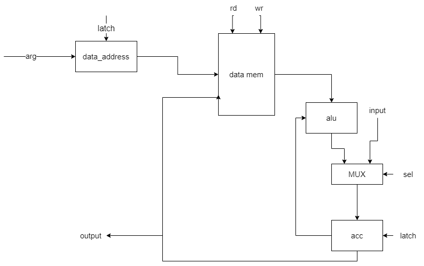
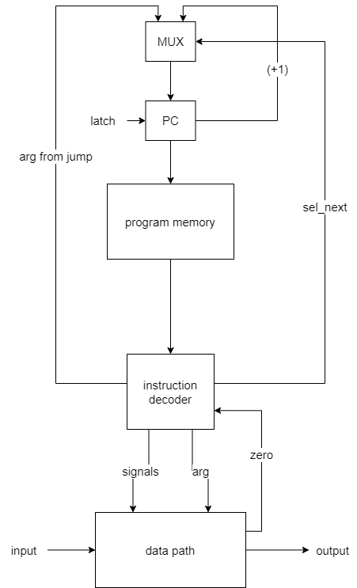

 # Alg. Транслятор и модель

- Нуруллаев Даниил P33121.
- `alg | acc | harv | hw | instr | struct | stream | port | prob5`

## Язык программирования

``` ebnf
program ::= term

term ::= command
        | number
        | string


command ::= "write" | "read" | while | "endWhile" | "=" | "==" | "if" | "else" | "endIf" | "+" | "-" | "/" | "*" | "%"

string ::= string name = "value"

number ::= number name =  value

```

Код выполняется последовательно. Операции:

- `+` -- ... `a b` >> ... `a+b` 
- `-` -- ... `a b` >> ... `a-b`
- `/` -- ... `a b` >> ... `a/b`
- `%` -- ... `a b` >> ... `a%b`
- `*` -- ... `a b` >> ... `a*b`
- `if` -- возьмёт два значения переданных в if и сравнит их, и если оно True, то перейдёт далее. Если False, то прыгнет на ELSE
- `else` -- сработает в случае, если операнды из if не равны
- `endIf` -- закрывает блок кода, принадлежащий if
- `while` -- проверяет опернад равен нулю или нет, если операнд равен нулю, то перейдет на endWhile+1, иначе пойдет дальше
- `endWhile` -- вовзращается на while 
- `read` -- читает данные из input_file в перменную (string | number), если перменная типа number, то запишет данные в ячейку памяти с прямой адресацией, если же переменная типа string, то запишет данные с косвенной адресацией 
- `write` -- запишет данные в output_buffer, если переменная типа number, то запишет данные из памяти с прямой адресацией в output_buffer, если же переменная типа string, то запишет данные из памяти с косвенной адрессацией в output_buffer

## Организация памяти
Модель памяти процессора:

1. Память команд. Машинное слово -- не определено. Реализуется списком словарей, описывающих инструкции (одно слово -- одна ячейка).
2. Память данных. Машинное слово -- 32 бита, знаковое. Линейное адресное пространство. Реализуется списком чисел.

Строки, объявленные пользователем распеделяются по памяти один символ на ячейку.

```text
Program memory
+-----------------------------+
| 00  : RD_MEM k              |
| 01  : JZ n                  |  
|    ...                      | 
| n   : HLT                   |
|    ...                      |
+-----------------------------+

Data memory
+-----------------------------+
| 00  : number                |
|    ...                      |
| 511 : number                |
| 512 : indirect              |
|    ...                      |
| 1023: indirect              |
| 1024: string                |
|    ...                      |
| 2047: string                |
+-----------------------------+
```

## Система команд

Особенности процессора:

- Машинное слово -- 32 бит, знаковое.
- `Память`:
    - адресуется через регистр `data_address`;
    - может быть записана:
        - с порта ввода;
        - с acc;
    - может быть прочитана:
        - в acc;
- Регистр аккумулятора: `acc`:
    - может быть подан на вывод;
    - используется как флаг (сравнение с 0);
    - см. память данных.
- Ввод-вывод -- порты ввода/вывода, токенизирован, символьный.
- `program_counter` -- счётчик команд:
    - инкрементируется после каждой инструкции или перезаписывается инструкцией перехода.


### Набор инструкции

| Syntax          | Mnemonic         | Кол-во тактов | Comment                           |
|:----------------|:-----------------|---------------|:----------------------------------|
| `+`             | ADD              | 2             | см. язык                          |
| `-`             | SUB              | 2             | см. язык                          |
| `/`             | DIV              | 2             | см. язык                          |
| `*`             | MUL              | 2             | см. язык                          |
| `%`             | MOD              | 2             | см. язык                          |
| `if`            | JNZ {else + 1}   | 1             | см. язык                          |
| `else`          | JMP {endIf}      | 1             | см. язык                          |
| `endIf`         | NOP              | 1             | см. язык                          |
| `while`         | JZ {endWhile + 1}| 1             | см. язык                          |
| `endWhile`      | JMP {while}      | 1             | см. язык                          |
| `write` {number}| WR_BUF           | 3             | см. язык                          |
| `write` {string}| WR_NMEM          | 5             | см. язык                          |
| `read` {number} | RD_BUF           | 3             | см. язык                          |
| `read` {string} | RD_NMEM          | 5             | см. язык                          |

### Кодирование инструкций

- Машинный код сериализуется в список JSON.
- Один элемент списка, одна инструкция.
- Индекс списка -- адрес инструкции. Используется для команд перехода.

Пример:

```json
[
   {
        "opcode": "RD_MEM",
        "arg": 3
    }
]
```

где:

- `opcode` -- строка с кодом операции;
- `arg` -- аргумент (может отсутствовать);

Типы данные в модуле [isa](./isa.py), где:

- `Opcode` -- перечисление кодов операций;
- `Term` -- структура для описания значимого фрагмента кода исходной программы.

## Транслятор

Интерфейс командной строки: `translator.py <input_file> <target_file> <data_section_file>"`

Реализовано в модуле: [translator](./translator.py)

Этапы трансляции (функция `translate`):
1. Трансформирование текста в последовательность значимых термов.
    - Переменные:
        - Транслируются в соответствующие значения на этапе трансляции.
        - Задаётся либо числовыми, либо строковыми значениями
2. Проверка корректности программы (одинаковое количество if, else, endIf и while, endWhile).
3. Генерация машинного кода.

Правила генерации машинного кода:

- одно слово языка -- одна или несколько инструкций;
- для команд, однозначно соответствующих инструкциям -- прямое отображение;
- для циклов с соблюдением парности (многоточие -- произвольный код):

    | Номер команды/инструкции | Программа | Машинный код |
    |:-------------------------|:----------|:-------------|
    | n                        | `while`   | `JZ (k+1)`   |
    | ...                      | ...       | ...          |
    | k                        | `endWhile`| `JMP (n)`    |
    | k+1                      | ...       | ...          |
- для условных операторов (многоточие -- произвольный код):

    | Номер команды/инструкции | Программа | Машинный код |
    |:-------------------------|:----------|:-------------|
    | n                        | `if`      | `JNZ k+1`    |
    | ...                      | ...       | ...          |
    | k                        | `else`    | `JMP (l)`    |
    | ...                      | ...       | ...          |
    | l                        | `endIf`   | `NOP`        |


## Модель процессора

Реализовано в модуле: [machine](./machine.py).

Сигналы (обрабатываются за один такт, реализованы в виде методов класса DataMemory):

- `latch_data_address` -- защёлкнуть значение в `data_address`

### DataPath



Сигналы (обрабатываются за один такт, реализованы в виде методов класса):

- `latch_acc` -- защёлкнуть в аккумулятор выход памяти данных;
- `wr` -- записать в data memory
- `rd` -- прочитать из data memory 

Флаги:

- `zero` -- отражает наличие нулевого значения в аккумуляторе.


### ControlUnit



Реализован в классе `control_unit`.

- Hardwired (реализовано полностью на python).
- Моделирование на уровне инструкций.
- Трансляция инструкции в последовательность (0-5 тактов) сигналов: `decode_and_execute`.

Сигнал:

- `latch_program_couter` -- сигнал для обновления счётчика команд в control_unit.

Особенности работы модели:

- Для журнала состояний процессора используется стандартный модуль logging.
- Количество инструкций для моделирования ограничено hardcoded константой.
- Остановка моделирования осуществляется при помощи исключений:
    - `EOFError` -- если нет данных для чтения из порта ввода-вывода;
    - `StopIteration` -- если выполнена инструкция `halt`.
- Управление симуляцией реализовано в функции `simulate`.

## Апробация

В качестве тестов для `machine` использовано 5 тестов:

1. [prob5_fast](examples/prob5_fast.javajs) -- программа, решающая 5 проблему Эйлера.
2. [prob5_light](examples/prob5_light.javajs) -- программа, решающая 5 проблему Эйлера.
3. [Hello World!](examples/helloworld.javajs) -- печатает Hello World!
4. [cat](examples/cat.javajs) -- программа, выводит то, что ввели.
5. [sum](examples/sum.javajs) -- программа, программа, считающая сумму чисел от 1 до 20.

В качестве тестов для `translator` использовано 2 теста:
1. [prob5](examples/prob5_fast.javajs) -- программа, решающая 5 проблему Эйлера.
2. [Hello world!](examples/helloworld.javajs) -- печатает Hello World!
3. [sum](examples/sum.javajs) -- программа, считающая сумму чисел от 1 до 20.

Интеграционные тесты реализованы тут: [machine_integration_test](./machine_integration_test.py) и [translator_integration_test](./translator_integration_test.py)

CI:

``` yaml
lab3-example:
  stage: test
  image:
    name: python-tools
    entrypoint: [""]
  script:
    - python3-coverage run -m pytest --verbose
    - find . -type f -name "*.py" | xargs -t python3-coverage report
    - find . -type f -name "*.py" | xargs -t pep8 --ignore=E501
    - find . -type f -name "*.py" | xargs -t pylint
```

где:

- `python3-coverage` -- формирование отчёта об уровне покрытия исходного кода.
- `pytest` -- утилита для запуска тестов.
- `pep8` -- утилита для проверки форматирования кода. `E501` (длина строк) отключено, но не следует этим злоупотреблять.
- `pylint` -- утилита для проверки качества кода. Некоторые правила отключены в отдельных модулях с целью упрощения кода.
- Docker image `python-tools` включает в себя все перечисленные утилиты. Его конфигурация: [Dockerfile](./Dockerfile).

Пример использования и журнал работы процессора на примере `cat`:

``` console
> cat examples/cat.javajs
string cat = ""
read(cat)
write(cat)
> cat examples/input.txt
LAB3 PO AK
> ./translator.py examples/cat.javajs examples/output.txt examples/data.txt
source LoC: 10 code instr: 11
> cat target.out 
[
    {
        "opcode": "RD_NMEM",
        "arg": 512
    },
    {
        "opcode": "WR_NMEM",
        "arg": 512
    },
    {
        "opcode": "HLT"
    }
]
> ./control_unit.py examples/output.txt examples/data.txt examples/input.txt
DEBUG:root:{TICK: 0,PC: 0, ACC: 0 } RD_NMEM 512
DEBUG:root:{TICK: 21,PC: 1, ACC: 75 } WR_NMEM 512
DEBUG:root:output: '' << 'L'
DEBUG:root:output: 'L' << 'A'
DEBUG:root:output: 'LA' << 'B'
DEBUG:root:output: 'LAB' << '3'
DEBUG:root:output: 'LAB3' << ' '
DEBUG:root:output: 'LAB3 ' << 'P'
DEBUG:root:output: 'LAB3 P' << 'O'
DEBUG:root:output: 'LAB3 PO' << ' '
DEBUG:root:output: 'LAB3 PO ' << 'A'
DEBUG:root:output: 'LAB3 PO A' << 'K'
DEBUG:root:{TICK: 44,PC: 2, ACC: 0 } HLT 
INFO:root:output_buffer: 'LAB3 PO AK'

LAB3 PO AK
instr_counter:  2 ticks: 44

```

| ФИО             | алг.  | code байт | code инстр. | инстр. | такт.  | вариант                                                |
|-----------------|-------|-----------|-------------|--------|--------|--------------------------------------------------------|
| Нуруллаев Д.    | hello | -         | 2           | 1      | 27     | alg, acc, harv, hw, instr, struct, stream, port, prob5 |
| Нуруллаев Д.    | cat   | -         | 3           | 2      | 44     | alg, acc, harv, hw, instr, struct, stream, port, prob5 |
| Нуруллаев Д.    | prob5 | -         | 47          | 8206   | 13507  | alg, acc, harv, hw, instr, struct, stream, port, prob5 |
